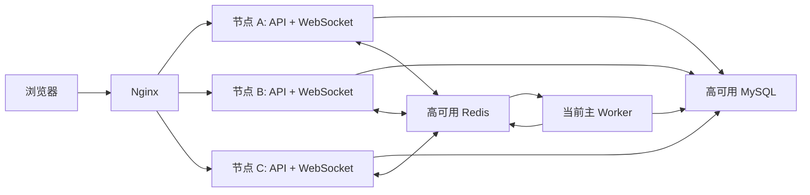

# 分布式高可用改造设计

## 1. 目标与范围

本次改造使同一版本的后端能够部署到多台机器，并由 Nginx 对 HTTP 和 WebSocket 请求进行负载均衡。所有节点共享同一套高可用 MySQL 和 Redis。

目标：

- API 和 WebSocket 节点支持 Active-Active，无需会话粘滞。
- 流程推进和超时处理由 Redis 选出的唯一主 Worker 执行。
- 流程操作先可靠写入 MySQL 命令队列，Worker 故障后可继续处理。
- 相同请求可以安全重试，不重复推进流程、写日志或发送通知。
- WebSocket 事件通过 Redis Pub/Sub 跨节点分发。
- Redis 只承担协调和实时通知；MySQL 是业务状态与恢复依据。
- 节点支持存活、就绪检查和优雅停机。

本次不建设 Redis Streams 消息重放、跨地域多活、MySQL/Redis 集群本身，也不引入新的外部消息队列。

## 2. 总体架构

每台机器运行相同后端程序，通过 `APP_ROLE` 控制职责：

- `api`：提供 HTTP 和 WebSocket，只提交流程命令，不直接推进流程。
- `worker`：参与 Worker 选主，只有主 Worker 消费命令并处理超时。
- `all`：同时提供 API/WebSocket 并参与 Worker 选主，是推荐生产配置。



API 节点不再直接调用进程内流程引擎。流程引擎仅存在于当前主 Worker 中，并可完全从 MySQL 恢复。

## 3. 可靠流程命令

### 3.1 命令表

新增 `drill_flow_command`：

| 字段 | 类型 | 说明 |
| --- | --- | --- |
| `id` | bigint unsigned | 命令 ID |
| `command_type` | varchar(64) | `start_drill`、`pause_drill`、`resume_drill`、`terminate_drill`、`start_step`、`complete_step`、`report_issue`、`skip_step`、`force_complete_step`、`resume_task`、`assign_step`、`update_step_info` |
| `drill_instance_id` | bigint unsigned | 演练 ID |
| `step_instance_id` | bigint unsigned nullable | 步骤实例 ID |
| `operator_id` | bigint unsigned | 操作人 |
| `idempotency_key` | varchar(128) | 客户端幂等键，全局唯一 |
| `payload` | json | 命令参数 |
| `status` | varchar(20) | `pending`、`processing`、`succeeded`、`failed` |
| `worker_id` | varchar(128) nullable | 领取命令的节点 |
| `lease_until` | datetime nullable | 命令处理租约 |
| `attempts` | int | 尝试次数 |
| `result` | json nullable | 成功结果 |
| `error_code` | varchar(64) nullable | 稳定错误码 |
| `error_message` | varchar(500) nullable | 可展示错误 |
| `created_at` | datetime | 创建时间 |
| `started_at` | datetime nullable | 首次开始时间 |
| `finished_at` | datetime nullable | 完成时间 |
| `updated_at` | datetime | 更新时间 |

索引：

- `UNIQUE(idempotency_key)`
- `INDEX(status, created_at, id)`
- `INDEX(drill_instance_id, status, id)`
- `INDEX(status, lease_until)`

### 3.2 提交与同步等待

客户端对每次修改请求发送 `Idempotency-Key`。未发送时，服务端生成 UUID 并在响应中返回，但自动重试只有在客户端复用该值时才能保证幂等。

API 处理流程：

1. 校验身份、权限、ID 格式和请求结构。
2. 将命令以 `pending` 状态写入 MySQL。
3. 若唯一键冲突，返回已有命令，不新建命令。
4. 最多等待可配置时间，默认 3 秒。
5. 命令已完成时沿用现有成功或业务错误响应。
6. 等待超时时返回 `202 Accepted`，响应包含命令 ID、状态和查询地址。

新增查询接口：

```text
GET /api/v1/flow-commands/:id
```

用户只能查询自己提交的命令；管理员和指挥员可以查询其权限范围内演练的命令。

### 3.3 命令领取与顺序

只有持有 Worker 主租约的节点可以领取命令。Worker 使用短事务和 `SELECT ... FOR UPDATE SKIP LOCKED` 领取最早的 `pending` 命令，更新为 `processing` 并设置命令租约。

同一演练同时只允许一个命令执行。执行前使用 MySQL 命名锁或等价的演练级数据库锁：

```text
drill-flow:<drill_instance_id>
```

锁必须绑定独占数据库连接，并在命令完成后释放；连接中断时由 MySQL 自动释放。不同演练可以并行处理。

超过 `lease_until` 的 `processing` 命令由新主 Worker 重置为 `pending`。命令重新执行时，业务状态检查负责判断它是已完成、可继续还是应失败。

## 4. Worker 选主与故障切换

Redis 键：

```text
drill:worker:leader
```

值为不可复用的 `worker_id + random_token`，使用 `SET key value NX PX <ttl>` 获取租约。续租和释放必须使用 Lua 脚本比较完整 token，禁止节点删除其他节点的租约。

默认参数：

- 主租约 TTL：15 秒
- 续租间隔：5 秒
- 命令租约：60 秒
- 命令轮询间隔：500 毫秒

Worker 行为：

1. 获取租约后进入 `recovering`，停止领取命令。
2. 从 MySQL 恢复所有 `running` 和 `paused` 演练。
3. 根据步骤的 `timeout_at` 恢复未来超时；已到期超时作为内部命令立即处理。
4. 接管过期的 `processing` 命令。
5. 恢复完成后进入 `leader-ready` 并开始领取新命令。

续租失败后，Worker 立即：

- 停止领取命令；
- 取消尚未开始的处理；
- 当前命令在下一个持久化边界前再次验证主租约；
- 无法确认租约时不提交新的状态变更。

Redis 不可用时不允许产生新主 Worker。API 查询仍可工作，但修改请求写入命令后返回 `202`，等待 Redis 恢复后执行。

## 5. 状态一致性与幂等

MySQL 是唯一业务事实来源。进程内流程引擎只作为当前命令执行期间的计算模型，不作为跨请求的权威状态。

所有状态变化使用条件更新，例如：

```sql
UPDATE drill_instance_step
SET status = 'completed', end_time = ?
WHERE id = ? AND status = 'running';
```

`RowsAffected = 1` 表示本命令完成状态转换；`RowsAffected = 0` 时重新读取状态：

- 已是目标状态：按幂等成功处理。
- 状态不允许转换：返回稳定业务错误。

同一事务内完成：

- 状态条件更新；
- 演练进度更新；
- 操作日志；
- 通知记录；
- 命令结果更新。

为防止重试生成重复副作用，日志和通知增加可空 `command_id`，并分别建立业务所需唯一索引。Worker 只在本命令实际完成状态转换时创建实时事件。

流程命令必须使用数据库当前状态重新构造流程上下文，不依赖 API 节点或旧主 Worker 的内存。

## 6. WebSocket 跨节点广播

新增统一事件总线接口：

```go
type EventPublisher interface {
    Publish(ctx context.Context, event Event) error
}

type EventSubscriber interface {
    Subscribe(ctx context.Context, handler func(Event)) error
}
```

Worker 完成业务事务后，将事件发布到 Redis Pub/Sub 频道：

```text
drill:events
```

事件包含唯一事件 ID、事件类型、演练 ID、用户 ID、负载和发生时间。每个 API 节点订阅频道，并仅向连接在本机的 WebSocket 客户端广播。

发布失败不回滚已经提交的业务事务。客户端断线重连后重新调用现有详情、步骤和通知接口，以 MySQL 状态完成最终一致。Redis 恢复后新事件继续实时分发。

单节点开发模式也走同一事件接口；Redis 不可用时可以降级为本机广播，但 `/ready` 返回失败，生产负载均衡不得继续向该节点分配流量。

## 7. 健康检查和生命周期

新增：

- `GET /live`：只检查进程是否存活。
- `GET /ready`：检查 MySQL Ping、Redis Ping、Redis 订阅状态；返回节点角色和 Worker 状态。

`/ready` 的 HTTP 语义：

- 所有必需依赖正常：`200`
- MySQL 或 Redis 不可用、节点正在关闭：`503`

Worker 未当选主节点不是失败。`worker` 角色节点在能够访问 MySQL/Redis并正常参与选主时仍可返回 `200`，响应中通过 `worker_status` 区分 `standby`、`recovering` 和 `leader-ready`。

优雅停机顺序：

1. 标记节点 not ready。
2. 停止接收新 HTTP 请求。
3. 停止领取流程命令。
4. 当前命令在超时范围内完成，否则保留租约供新主接管。
5. 主 Worker 使用 compare-and-delete 释放租约。
6. 关闭 Redis 订阅和 WebSocket。
7. 关闭 HTTP、Redis 和数据库连接。

## 8. 配置

配置允许由环境变量覆盖，至少包括：

```text
APP_ROLE=all
INSTANCE_ID=<machine-or-container-id>
DATABASE_HOST
DATABASE_PORT
DATABASE_USER
DATABASE_PASSWORD
DATABASE_NAME
REDIS_ADDR
REDIS_PASSWORD
JWT_SECRET
PUBLIC_BASE_URL
CAS_PUBLIC_URL
CAS_SERVICE_URL
WORKER_LEASE_TTL
WORKER_RENEW_INTERVAL
COMMAND_WAIT_TIMEOUT
LOGIN_LOG_FILE
```

生产环境要求：

- 所有节点使用同一个 JWT Secret。
- `INSTANCE_ID` 在存活节点间唯一。
- CAS 回调使用 Nginx 暴露的公网域名。
- 登录日志默认写 stdout；仅本地开发时允许额外写文件。
- CORS 和 WebSocket Origin 由 `PUBLIC_BASE_URL` 派生或显式配置。

## 9. Nginx

HTTP 与 WebSocket 使用同一个后端 upstream 和 `8080` 端口：

```nginx
upstream drill_backend {
    least_conn;
    server 10.0.0.11:8080 max_fails=3 fail_timeout=10s;
    server 10.0.0.12:8080 max_fails=3 fail_timeout=10s;
    server 10.0.0.13:8080 max_fails=3 fail_timeout=10s;
    keepalive 32;
}
```

`/api/` 和 `/ws/` 均保留原始 URI，不使用会删除 `/api` 前缀的错误路径改写。WebSocket 设置 Upgrade/Connection 头并使用较长读取超时。负载均衡不使用 `ip_hash` 或 sticky session。

生产环境应由外部健康检查依据 `/ready` 摘除异常节点；开源 Nginx 的被动检查只能作为补充。

## 10. 迁移与兼容

迁移顺序：

1. 创建命令表，并为日志、通知增加 `command_id`。
2. 部署支持新表但仍可读取旧数据的版本。
3. 启用 Redis 事件总线。
4. 将修改接口切换为提交命令。
5. 启用 Worker 选主和命令消费。
6. 最后扩容到多个节点并启用 Nginx upstream。

数据库迁移必须可重复检测，且不得删除现有演练数据。旧记录的 `command_id` 保持 `NULL`。

## 11. 验证标准

自动化测试：

- 相同幂等键只创建一条命令。
- 只有持有正确租约 token 的 Worker 能续租和释放。
- 非主 Worker 不领取命令。
- 同一演练的命令串行，不同演练可并行。
- 命令处理超时后可由新主接管。
- 重复完成步骤按幂等成功处理，不重复写日志、通知或推进后续步骤。
- Redis Pub/Sub 事件能在两个 WebSocket Manager 实例之间传播。
- MySQL 或 Redis 不可用时 `/ready` 返回 `503`。

双节点集成验证：

1. 启动共享 MySQL、Redis 和两个 `APP_ROLE=all` 后端。
2. 通过 Nginx 轮询访问两个节点。
3. WebSocket 连接节点 B，修改请求落到节点 A，节点 B 能收到事件。
4. 创建并完成一条演练，确认状态、日志和通知只有一份。
5. 在运行中停止主 Worker，备用节点在租约过期后恢复演练并处理后续命令。
6. 在命令处理期间重复提交相同幂等键，确认最终结果一致。
7. 断开 Redis，确认节点 not ready 且没有出现双主；恢复后命令继续执行。

只有以上自动化测试和双节点故障切换验证通过，才认为代码满足本次多机分布式部署要求。
